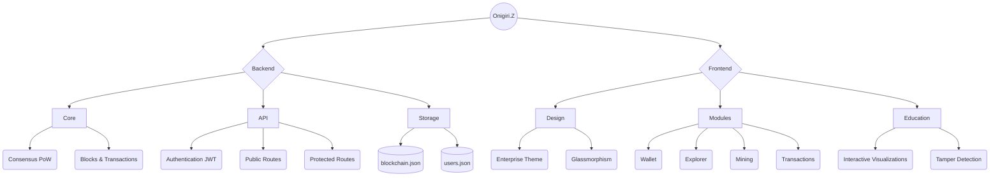

# Onigiri.Z: Enterprise Blockchain Node 🍙

**Onigiri.Z** is a high-performance, modular blockchain platform built with a **Go** backend and **TypeScript** frontend. It features Proof of Work (PoW) mining, JWT authentication, and a premium enterprise dashboard.

## Key Features
- **Proof of Work (PoW)**: Mining with configurable difficulty (4 leading zeros).
- **JWT Authentication**: Secure register/login with bcrypt password hashing.
- **Transaction Mempool**: Async transaction pooling before block creation.
- **Persistent Storage**: JSON file-based persistence for blockchain and user data.
- **TypeScript Frontend**: Fully typed Vite + TypeScript dashboard with strict interfaces.
- **Docker Support**: Production-ready containerized deployment.

## 🛠️ Getting Started

### Prerequisites
- [Go 1.26+](https://golang.org/dl/)
- [Node.js 20+](https://nodejs.org/)
- [Docker](https://www.docker.com/) (Optional)

### Run Locally
```bash
# 1. Build the frontend
cd frontend
npm install
npm run build
cd ..

# 2. Build and run the Go server
go build .
./simple-blockchain     # Linux/macOS
./simple-blockchain.exe # Windows
```

Open [http://localhost:8080](http://localhost:8080) in your browser.

### Development Mode (with hot reload)
```bash
# Terminal 1: Go server
go run .

# Terminal 2: Vite dev server (proxies API to :8080)
cd frontend && npm run dev
```

### Docker
```bash
docker build -t onigiri-z .
docker run -p 8080:8080 onigiri-z
```

## 📡 API

| Endpoint | Method | Auth | Description |
|:---|:---|:---|:---|
| `/api/register` | POST | Public | Create a new user account |
| `/api/login` | POST | Public | Authenticate and receive JWT |
| `/api/blockchain` | GET | Public | View the full blockchain |
| `/api/mempool` | GET | JWT | View pending transactions |
| `/api/transaction` | POST | JWT | Submit a transaction |
| `/api/mine` | POST | JWT | Mine a new block |

## 🏗️ Architecture


- **Go Backend**: `main.go`, `types.go`, `blockchain.go`, `handlers.go`, `auth_handlers.go`, `users.go`
- **TypeScript Frontend**: `frontend/src/main.ts`, `frontend/src/auth.ts`, `frontend/src/types.ts`
- **Build System**: Vite 5 + TypeScript 5.6
- **Data**: `blockchain.json`, `users.json`

---
© 2026 Onigiri.Z Enterprise
